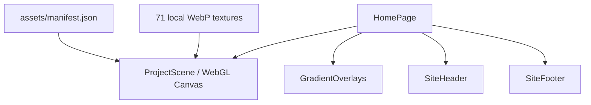
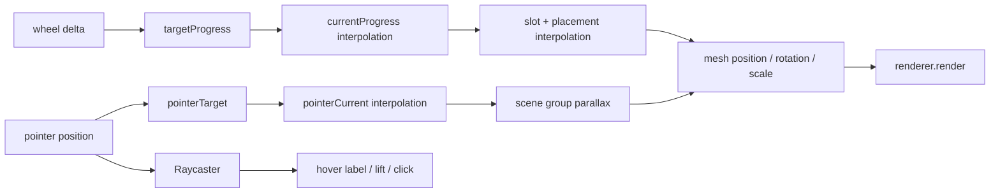

# Gabriel Veres Homepage — Design & Technical Philosophy

> 本文档解释当前复刻站“为什么这样设计、如何实现、后续应如何演进”。
> 精确视觉尺寸、颜色、构图和响应式合同见 [`DESIGN.md`](./DESIGN.md)。

## 1. 文档定位

这不是第二份视觉 Token 表，而是一份面向后续 Agent 的决策记录。它覆盖：

- 产品与设计哲学。
- 功能和交互模型。
- Three.js 场景架构。
- 状态、坐标、纹理与资源生命周期。
- 技术选型及未选方案。
- 性能、可访问性、容错与测试原则。
- 已知边界和推荐演进方向。

若实现与本文档冲突：

1. 用户最新要求优先。
2. `DESIGN.md` 的可见设计合同优先。
3. 本文档用于选择满足设计合同的实现方式。

## 2. 核心设计哲学

### 2.1 作品集不是页面集合，而是一个空间索引

传统作品集依赖纵向 Section、卡片 Grid 和详情页入口。当前首页刻意放弃这些熟悉结构，
把全部作品压缩成一条可循环的空间队列。

这带来三个效果：

- 用户首先感知作品的视觉语言，而不是项目分类。
- 多个项目同时出现，形成连续的创作轨迹。
- 滚轮成为“翻阅作品”的直接工具，不再只是浏览器滚动机制。

因此，新增功能不应轻易引入普通 Grid、Pagination 或纵向内容区。若确实需要列表，
应进入独立的 `/projects` 页面，而不是破坏首页的单视口模型。

### 2.2 黑色负空间是内容，而不是未使用区域

左侧和上方的大面积黑色区域承担以下职责：

- 与密集的项目纹理形成视觉张力。
- 给固定导航提供稳定阅读背景。
- 强调作品队列从视口外延伸进来的空间感。
- 避免首页成为“作品缩略图墙”。

后续 Agent 不应为了“填满空间”而增加标语、按钮、说明文字或装饰粒子。
空白比例本身就是设计的一部分。

### 2.3 作品纹理负责色彩，界面负责秩序

页面 UI 几乎只有黑、白、透明灰和交互荧光黄绿色。丰富色彩全部来自作品图片。

这条原则意味着：

- UI 不和作品竞争。
- 新增控件默认采用既有玻璃胶囊语言。
- 强调色只表示真实的 Hover、Focus 或选择状态。
- 不用阴影、渐变描边、彩色光晕制造额外层次。

### 2.4 动效是导航语法，不是装饰

队列惯性、指针视差和标签交换都在解释界面如何工作：

- 惯性表明作品属于连续队列。
- 深度与遮挡表达项目之间的空间顺序。
- 指针视差提醒用户场景是可交互的。
- Hover 提升和标题说明当前命中的项目。
- 胶囊文字交换提供明确但克制的控件反馈。

如果动效不能帮助理解空间、状态或可操作性，就不应加入。

### 2.5 响应式是重新构图，不是缩放

移动端保留相同的作品顺序和视觉语言，但使用独立的相机距离、平面宽度与位置表。
它有意放大并裁切项目，让触屏小视口仍具有强烈的空间张力。

因此不要用单一 `scale()` 或统一公式替代桌面/移动端位置表。两套位置表是艺术指导数据，
而不是等待抽象掉的重复代码。

## 3. 功能模型

### 3.1 页面状态

首页只有一个视觉状态空间，没有传统路由内 Section 状态。

核心运行状态：

| 状态 | 含义 |
|---|---|
| `targetProgress` | 滚轮输入累计的目标队列位置 |
| `currentProgress` | 带惯性追赶的当前队列位置 |
| `pointerTarget` | 当前指针归一化目标 |
| `pointerCurrent` | 平滑后的视差指针位置 |
| `hoveredIndex` | Raycaster 当前命中的项目 |
| `mobile` | `innerWidth < 768` |
| `reducedMotion` | 系统减少动态偏好 |
| `contextLost` | WebGL 上下文是否暂时丢失 |

React 只负责挂载 Canvas 和语义 DOM；高频状态保存在 `useEffect` 闭包和 Three.js 对象中，
避免每一帧触发 React 重渲染。

### 3.2 数据合同

唯一项目数据源：

```text
public/assets/manifest.json
```

每条记录满足：

```ts
interface ProjectTexture {
  id: string;
  index: number;
  title: string;
  slug: string;
  sourceRef: string;
  sourceUrl: string;
  localPath: string;
  width: number;
  height: number;
  aspectRatio: number;
}
```

约束：

- 数组顺序就是空间队列顺序。
- `index 36` 是初始活动项目。
- 标题可能重复，不能把 `title` 当作唯一键。
- slug 和纹理地址不在组件内手写。
- 项目详情仍链接至原站，这是当前复刻范围的明确边界。

### 3.3 时间功能

Header 时间显示浏览器本地时间：

- 初始化时立即计算。
- 先等待至下一分钟边界。
- 之后每 `60_000ms` 更新。
- 格式固定为 `HH:MM AM/PM`。

这样可以避免计时器从任意秒数开始后长期偏离分钟边界。

## 4. 技术架构

### 4.1 技术栈

| 技术 | 当前版本 | 职责 |
|---|---:|---|
| Next.js | `16.2.12` | App Router、构建与静态输出 |
| React | `19.2.6` | 页面与固定 UI 组件 |
| TypeScript | `5.7.3` | 严格类型和数据合同 |
| Three.js | `0.185.1` | WebGL2 场景、相机、纹理、Raycaster |
| CSS Modules | 随 Next.js | 局部样式和固定 UI |
| pnpm | 当前环境 `11.x` | 依赖管理和锁文件 |

项目开启：

- TypeScript `strict: true`。
- `moduleResolution: bundler`。
- Next.js `output: "standalone"`。
- Turbopack root 固定为当前克隆目录。

中国网络环境安装依赖：

```powershell
pnpm install --registry=https://registry.npmmirror.com
```

### 4.2 页面组合



文件职责：

| 文件 | 所有权 |
|---|---|
| `src/app/page.tsx` | 只负责层级装配 |
| `src/app/globals.css` | 字体、全局颜色、视口与滚动规则 |
| `src/components/ProjectScene.tsx` | Three.js 生命周期与场景交互 |
| `ProjectScene.module.css` | Canvas、Hover Label 和语义后备链接 |
| `SiteHeader.tsx` | 导航、品牌、本地时间 |
| `SiteFooter.tsx` | 邮箱、Overview、Index |
| `GradientOverlays.tsx` | 顶部/底部可读性保护层 |
| `public/assets/manifest.json` | 项目顺序和资源元数据 |
| `scripts/download_assets.py` | 可复现资源下载 |

### 4.3 层级隔离原则

WebGL 只负责作品空间。导航、时间、Footer 和 Hover Label 均保留为 DOM。

原因：

- 文字保持清晰，不受 Canvas 像素比影响。
- Header/Footer 保留真实链接和 Focus 行为。
- UI 可独立响应断点和 reduced-motion。
- WebGL context loss 不会让整个页面完全失去导航。
- 设计层和场景层可以独立校准。

不要把所有界面都绘制进 Canvas，也不要让 Three.js 相机控制固定 UI。

## 5. Three.js 场景哲学

### 5.1 为什么从 CSS 3D 迁移到 Three.js

CSS 3D 原型适合快速复刻构图，但有以下上限：

- 每个项目都是 DOM 节点，71 个节点持续参与样式和合成。
- 深度、命中与透视依赖浏览器 CSS 合成模型。
- 难以继续加入顶点形变、Shader 或后期处理。

Three.js 提供：

- 真实透视相机和 GPU 深度缓冲。
- 纹理与几何体的显式生命周期。
- Raycaster 命中。
- 未来自定义 Shader 的演进路径。

当前仍使用直接 Three.js，而不是 React Three Fiber。原因是场景只有一个 Canvas、
一个共享几何体和一组受控 Mesh；直接生命周期更透明，也减少一层抽象和额外依赖。

### 5.2 为什么不是原生 WebGL

原生 WebGL 需要手动处理：

- Shader 编译和 Program。
- Buffer、Attribute、Uniform。
- 相机矩阵和投影矩阵。
- 纹理上传、过滤和释放。
- Ray picking。

这些能力并不是本页面的差异化价值。Three.js 保留 GPU 能力，同时把工程工作集中在
构图、交互和资源策略上。

### 5.3 为什么使用 `MeshBasicMaterial`

项目图片已经包含完整的摄影、排版和光影信息。场景需要准确显示作品，而不是对它重新打光。

`MeshBasicMaterial` 的优势：

- 不需要灯光。
- 纹理颜色稳定。
- Shader 成本较低。
- 更接近“作品截图作为平面”的原始视觉。

如果未来加入 Shader，应优先从顶点形变开始，不要先加入环境光、PBR 或阴影。

## 6. 相机与坐标系统

### 6.1 像素映射相机

相机使用 `PerspectiveCamera`，并根据视口高度动态计算 FOV：

```text
fov = 2 × atan(viewportHeight / (2 × cameraDistance))
```

这样在 `z = 0` 时，一个 Three.js 世界单位近似对应一个 CSS 像素，便于复用浏览器测量得到的
`vw`、`vh` 和像素深度参数。

相机距离：

- Desktop/Tablet：`1500`。
- Mobile：`1150`。

### 6.2 CSS 透视原点兼容

位置表以平面左上角的 `vw`/`vh` 表达，而 Three.js Mesh 以中心点定位。
转换流程：

1. 用 viewport width 计算平面像素宽度。
2. 用 manifest `aspectRatio` 计算高度。
3. 得到未投影的平面中心。
4. 计算 `distance / (distance - z)` 透视比例。
5. 以桌面 `64% 46%` 或移动 `65% 43%` 作为视觉透视原点。
6. 将屏幕坐标转换为 Three.js 中心原点、Y 轴向上的世界坐标。

这段数学的目标不是通用 3D 引擎，而是保持从 CSS 3D 原型校准出的截图构图。
修改时应以视觉回归结果为准。

### 6.3 旋转方向

CSS 屏幕坐标的 Y 轴向下，Three.js 世界坐标的 Y 轴向上，因此 `rotateX` 和 `rotateZ`
在进入 Three.js 时需要符号修正。不要在不了解坐标差异的情况下删除负号。

## 7. 队列与插值

### 7.1 循环索引

每个项目相对活动索引的位置：

```text
unwrapped = projectIndex - initialIndex - progress
relativeSlot = wrap(unwrapped, -count/2, count/2)
```

这让 71 个项目在两个方向都可无限循环，无需复制数组。

### 7.2 连续插值

位置表只为整数 Slot 提供关键帧。任意滚轮进度通过相邻 Slot 线性插值：

- `x`
- `y`
- `width`
- `z`
- `rotateX`
- `rotateY`
- `rotateZ`

这比离散切换项目更重要：用户看到的是一条连续轨迹，而不是 Carousel 换页。

### 7.3 边界外延

超出 `-5...6` 的 Slot 使用边缘参数继续外推：

- 近景继续向左下方和相机方向移动。
- 远景继续向右上方和远离相机方向移动。
- 宽度存在最小值，避免远景反转或消失异常。

只有处于可见窗口的 Mesh 会参与渲染和 Raycaster。

## 8. 输入与动画管线



### 8.1 滚轮

- 在 `window` 监听 `wheel`。
- `preventDefault()`，因为文档不允许滚动。
- 单次 delta 截断在 `[-140, 140]`。
- 目标进度增量为 `delta / 430`。
- 普通模式每帧以 `0.075` 系数追赶。

这些数值共同定义“有重量但不迟钝”的手感。修改其中一个参数时，必须同时测试短滚轮、
快速连续滚轮和反向滚轮。

### 8.2 指针视差

- 指针归一化到 `[-1,1]`。
- 当前指针以 `0.055` 系数追赶目标。
- 场景组最大平移约 `14px × 10px`。
- 最大旋转约 `0.7deg × 0.9deg`。

视差只提供空间反馈，不承担项目切换。过大的视差会破坏已经校准的视觉构图。

### 8.3 Raycaster

Raycaster 只检查 `visibleMeshes`：

- 降低命中计算成本。
- 避免命中视口外但几何上仍存在的平面。
- 让真实深度顺序决定最前方项目。

桌面 Pointer Move：

1. 更新 NDC。
2. 更新 Scene/Camera 世界矩阵。
3. 对可见 Mesh 射线检测。
4. 更新标题、指针、前移与缩放。

点击会使用点击坐标重新执行一次 Raycast，而不是只依赖此前的 Hover 状态。
这是为了保证触屏轻点在没有 `pointermove` 的情况下仍能访问项目。

## 9. 纹理与显存策略

### 9.1 为什么不能一次加载 71 张纹理

WebP 文件在网络和磁盘上是压缩的，但上传 GPU 后通常需要展开为未压缩纹理。
如果 71 张高分辨率项目图同时驻留，会显著增加显存和内存压力。

当前策略：

- Mesh 和 Material 可以为 71 个项目预先创建。
- 纹理只加载当前进度附近的窗口。
- 纹理候选范围约为 Slot `-8.25...10.25`。
- 缓存上限 `20`。
- 候选按距活动 Slot 的绝对距离排序。
- 离开窗口的纹理立即从 Material 移除并 `dispose()`。

### 9.2 异步竞态

纹理可能在项目已经离开缓存窗口后才加载完成。每次请求带递增 Request ID：

- 若完成时 Request ID 已失效，立即释放纹理。
- 若项目不再属于目标窗口，立即释放纹理。
- 只有仍属于当前目标窗口的纹理才能写入 Material。

任何纹理缓存重构都必须保留这类竞态保护。

### 9.3 GPU 参数

- Renderer 像素比上限：`1.75`。
- 纹理各向异性上限：`4` 或设备支持值中的较小者。
- 输出色彩空间：`SRGBColorSpace`。
- 一个共享 `PlaneGeometry(1,1)`。
- 每项目一个 Material，以便独立设置纹理和透明度。
- 开启 `depthTest` 和 `depthWrite`。

像素比上限是清晰度与填充率之间的取舍。不要默认使用无限制的
`window.devicePixelRatio`。

## 10. 生命周期与容错

### 10.1 React 生命周期

Three.js 场景完全建立在单个 `useEffect` 内，并在 cleanup 中：

- 取消 `requestAnimationFrame`。
- 移除 wheel、pointer、resize、context 和 media-query 监听器。
- 释放缓存纹理。
- 清空 Group 和 Scene。
- 释放所有 Material。
- 释放共享 Geometry。
- `renderer.dispose()`。
- 主动释放 WebGL Context。

删除任何 cleanup 步骤前，必须确认资源仍由其他对象共享，否则容易产生开发热更新后的显存泄漏。

### 10.2 WebGL Context Loss

Canvas 监听：

- `webglcontextlost`
- `webglcontextrestored`

丢失时：

- 阻止默认销毁流程。
- 停止渲染调用。
- 清除 Hover。
- 保留 React 固定 UI。

恢复时：

- 重置 Renderer 状态。
- 重新计算 Renderer 和相机尺寸。
- 恢复动画循环中的绘制。

### 10.3 WebGL 不可用

若无法获取 WebGL2：

- Canvas 保持黑色。
- Header、Footer 和渐变仍存在。
- Canvas 标记 `data-webgl-unavailable="true"`。
- 视觉隐藏的项目链接仍保留语义入口。

当前没有可见的静态图片 Fallback，这是已知限制。

## 11. 可访问性哲学

Canvas 适合视觉渲染，不适合表达 71 个可访问链接，因此采用混合语义：

- Canvas `aria-hidden="true"`。
- 固定 Header/Footer 是真实 DOM 链接。
- 项目列表另有视觉隐藏的 `<nav>` 和真实 Anchor。
- 导航 Hover 与 `:focus-visible` 共享视觉状态。
- Reduced Motion 保留功能，只移除非必要的平滑尾随。

当前限制：

- 视觉隐藏的项目链接可以被读屏器发现，但没有对应的可见键盘焦点画面。
- Canvas 项目没有方向键导航。
- 移动端没有拖拽/滑动切换队列，只支持初始构图、轻点项目及具备滚轮的设备。

若后续要完善键盘体验，推荐增加一个可见的 Focus Project 控件或 Index Overlay，
而不是试图让 Canvas 本身承担完整 DOM 语义。

## 12. 为什么 UI 仍使用 CSS

Header、Footer 和 Hover Label 使用 CSS，而不是 Three.js Sprite/Text：

- 浏览器字体排版更准确。
- 响应式断点表达更直接。
- `:hover`、`:focus-visible` 和邮件链接保持原生行为。
- 可独立于 GPU 刷新频率。
- 修改 UI 不需要重建场景资源。

CSS Modules 将组件样式隔离，避免 Header 与 Footer 中同名 `labelTrack` 互相污染。

## 13. 性能原则

按优先级排序：

1. 保持交互稳定帧率。
2. 保持当前可见纹理清晰。
3. 控制显存与热更新泄漏。
4. 保持构图一致。
5. 最后才增加 Shader 和后处理。

实现守则：

- 不在动画帧内触发 React `setState`。
- 不在每帧创建新的 Geometry、Material、Texture 或大型数组缓存。
- Raycaster 只处理可见 Mesh。
- 纹理窗口变化时才同步缓存。
- Resize 后重新计算相机和世界坐标。
- 不为不可见项目保留 GPU 纹理。
- 不使用实时阴影、灯光或昂贵后期处理来装饰平面截图。

## 14. 工程与验证

### 14.1 常用命令

```powershell
pnpm run dev
pnpm run typecheck
pnpm run build
```

资源重新抓取：

```powershell
pnpm run assets
```

### 14.2 每次场景修改后的最低验证

1. `pnpm run typecheck`。
2. `pnpm run build`。
3. `1440 × 1000` 初始截图。
4. `390 × 844` 初始截图。
5. `768 × 900` 确认仍为桌面模式。
6. 滚轮前后 Canvas 图像必须变化。
7. 指针命中 XYLO 等可见项目时标题正确。
8. 点击命中项目后 URL 正确。
9. 浏览器 Console 无错误。
10. Resize 后 Canvas 的绘图尺寸与视口一致。

当前已验证：

- Three.js Desktop/Mobile 构图。
- `768px` 严格桌面断点。
- 滚轮驱动的 Canvas 图像变化。
- Raycaster 命中 `XYLO`。
- 点击跳转 `/projects/xylo`。
- Console 无错误。

## 15. 修改策略

### 15.1 修改固定 UI

先改对应 CSS Module，不要修改 Three.js 相机或位置表。

### 15.2 修改作品构图

按以下顺序：

1. 只改目标断点的位置表。
2. 在基准视口截图。
3. 检查主平面、前景遮挡和后景露出。
4. 再调整相机距离或透视原点。

不要同时修改位置、相机、FOV 和 Pointer Parallax，否则无法判断视觉差异来源。

### 15.3 修改队列手感

分别控制：

- `delta / 430`：滚轮灵敏度。
- `0.075`：进度惯性。
- `0.055`：指针惯性。
- Group 平移/旋转：视差幅度。

一次只改一类参数，并记录前后截图与交互感受。

### 15.4 增加项目

- 更新 manifest 和本地纹理。
- 保证 `id` 唯一。
- 保持数组顺序正确。
- 不需要为项目新增 Mesh 组件文件。
- 重新验证循环边界和纹理缓存。

## 16. 已知边界

- 只复刻首页；内部 Work/About/Blog/Contact 路由未实现。
- 项目详情跳转原站。
- 原站自定义 Cursor 尚未复刻。
- 当前无自定义顶点/片元 Shader。
- 没有扭曲、波浪或后处理效果。
- 移动端没有手势拖拽队列。
- WebGL2 不可用时只有黑色场景，而非可见静态项目图。
- 项目语义后备链接缺少可见键盘焦点对应物。

这些边界应在扩展前明确，不应通过隐蔽的局部 Hack 假装已经解决。

## 17. 推荐演进路线

### 阶段 1：交互完整性

- 增加移动端水平/垂直拖拽切换。
- 增加可见键盘 Focus/Index 模式。
- 增加 WebGL 不可用时的静态主视觉后备。

### 阶段 2：原站动态还原

- 使用自定义 Vertex Shader 进行轻微平面弯曲。
- 让弯曲幅度受滚轮速度而不是绝对位置驱动。
- 保持纹理中心和文字区域可读，避免过度变形。

### 阶段 3：体验与监控

- 根据设备能力自适应 DPR 和缓存上限。
- 记录 WebGL context loss 和纹理失败。
- 对低端设备提供 Reduced Quality 模式。

不建议优先加入：

- 实时阴影。
- PBR 光照。
- 大规模粒子。
- Bloom、景深等重型后处理。
- 与作品内容无关的背景噪声。

## 18. Agent 决策检查表

在修改前回答：

- 这项变化是在增强作品浏览，还是只在填充空间？
- 它是否破坏单视口和黑色负空间？
- 它属于 DOM UI，还是 WebGL 场景？
- 它会不会让 71 张纹理同时驻留？
- 它是否保留 `768px` 的严格断点？
- Reduced Motion 下是否仍可用？
- WebGL context loss 时固定 UI 是否仍存在？
- 是否需要更新 `DESIGN.md` 的可见合同？
- 是否有同尺寸截图证明改动没有破坏构图？

如果不能清楚回答这些问题，应先停止实现并重新确认设计意图。
